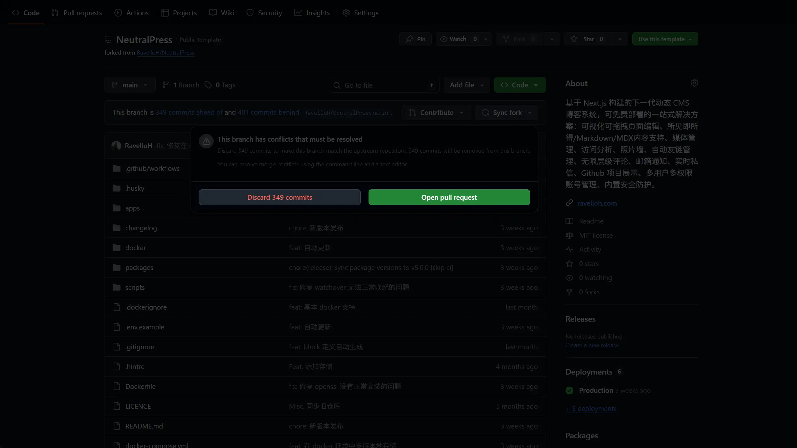

NeutralPress 可以在云平台部署和 Docker 部署两种方式下自动更新。或者，你也可以选择手动更新。

## 触发更新

### 云平台部署

当你使用 Github Fork 的方式部署在云平台上时，NeutralPress 可以自动触发 Fork Sync API，或者你也可以在你的 Github 仓库中，手动点击 "Sync fork" 来触发更新。

由于 Github API 能力限制，有时可能会出现冲突，无法自动更新，此时请手动点击仓库的"Discard ... commits"来放弃这些冲突的提交，然后再次点击 "Sync fork" 来触发更新。

自动更新实际上就是帮你使用 Github API 去调用这个操作，你可以在设置中配置你的仓库地址、PAT、分支信息，随后即可自动更新。配置 PAT 可参考 [Github 仓库信息同步](/docs/settings/github-sync) 。注意你需要选中整个 repo 权限组。

触发更新后，你的云平台应该就可以检测到此次更改，并自动切换到新版本了。

（如果你直接使用 Vercel Deploy 或者直接 Clone 仓库的话，那么就无法轻松更新到上游了。你需要将你的现有仓库 Clone 到本地，然后下载上游的最新代码，最后将你的修改合并到最新的上游代码中，最后再 Push 到你的仓库中。）

### Docker 部署

使用 Docker 部署的话更新非常简单，只需要在设置中点击自动更新即可。这可能需要几分钟的时间，期间可能导致服务中断。
